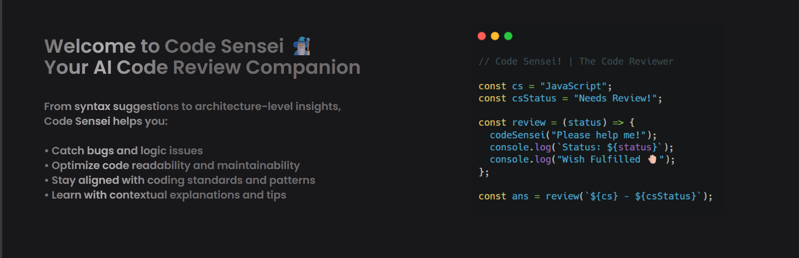

# 🧙🏻‍♂️ Code Sensei – Your AI Code Review Companion

Code Sensei is a modern React-based web application that leverages the power of Google's Gemini AI to review your code in real-time. Whether you're debugging, optimizing, or just seeking a second opinion—Code Sensei helps you level up your code quality instantly.

 <!-- Optional: Add a screenshot/preview -->

---

## 🔥 Features

- 🔍 **AI-Powered Code Review** – Get insightful feedback from Google's Gemini model.
- 🌐 **Multi-language Support** – Supports 20+ popular programming languages including JavaScript, Python, Java, C++, Rust, TypeScript, and more.
- ⚡ **Instant Suggestions** – Understand logic, syntax, bugs, and improvements at a glance.
- 🖥️ **Monaco Editor** – Full-featured code editing experience in the browser.
- 🧠 **ShinyText Effects** – Visually engaging UI elements.
- 📜 **Markdown Rendered Review** – Output rendered beautifully for easy reading.
- 🧭 **Smooth Scroll & Loader Feedback** – Enhanced UX with animations and loaders.
- 🔔 **Toast Notifications** – Graceful error handling and messages.

---

## 🚀 Getting Started

### 1. Clone the Repository

```bash
git clone https://github.com/VishnuJha100/Code-Sensei.git
cd Code-Sensei
```

### 2. Install Dependencies

```bash
npm install
```
### 3. Add Your API Key
#### Create a .env file in the root: (🗝️ Get your API key from Google AI Studio.)

```
VITE_GOOGLE_GEMINI_KEY=your_api_key_here
```
### 4. Start the Development Server

```bash
npm run dev
```

#### Open your browser at http://localhost:5173

## 📁 Project Structure

```bash
Code-Sensei/
├── assets/          # Static assets like images
├── styles/          # Custom components like ShinyText
├── components/      # Modular React components (if any)
├── App.jsx
├── Home.jsx
├── main.jsx
├── index.css
└── ...
```

## 🧠 How It Works

- You write or paste your code into the Monaco Editor.
- Select the appropriate language.
- Click Review.
- Code Sensei sends your code to Google's Gemini model.
- The model returns a detailed review including:
- ✅ Quality Rating
- 🛠️ Suggestions
- 🔍 Line-by-line explanation
- 🐞 Bug & error detection 
- 💡 Fixes and improvements

## 📦 Tech Stack

- React + Vite
- Tailwind CSS
- Monaco Editor
- Google Generative AI (Gemini API)
- React Select
- React Markdown
- React Spinners
- React Hot Toast

## ✨ Future Enhancements

- Save & share review history
- Auth integration
- Dark/light toggle
- Multi-file or project-level review

## 📜 License
- MIT License © Vishnu Deb Jha

## 🙌 Acknowledgements
- Google GenAI team for the Gemini API
- Monaco Editor contributors
- React ecosystem community